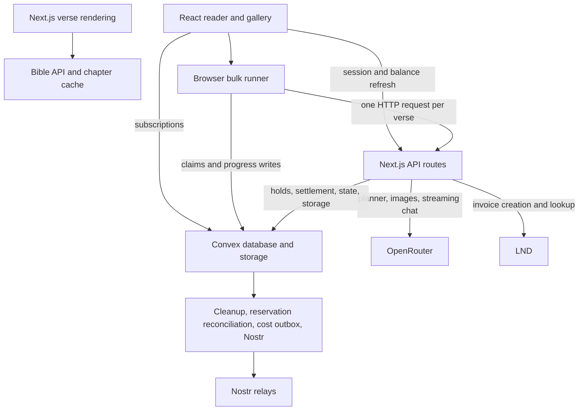
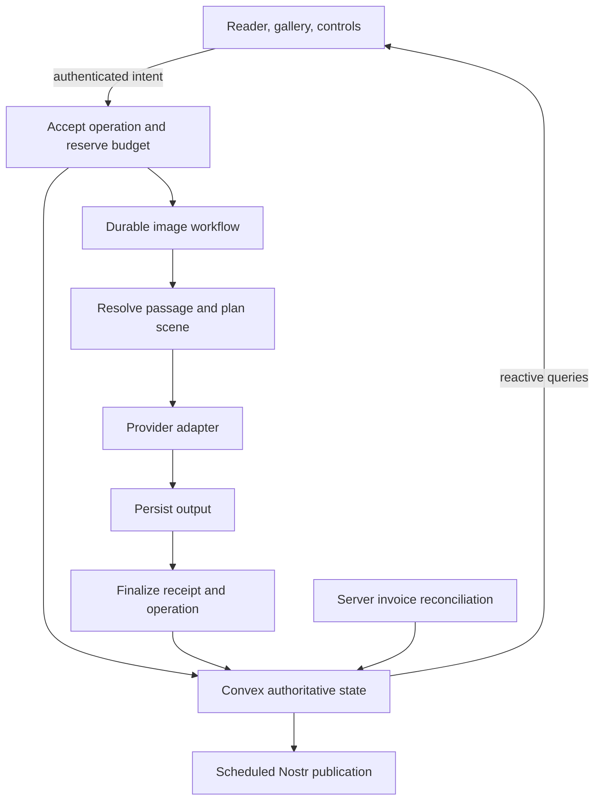

# Visibible rebuild assessment

Investigated September 7, 2026, against commit `6ae4568`. This is an architectural assessment and source investigation, not a production incident report. Application code was not changed. Existing balances, invoices, images, URLs, and publication records are assumed to require preservation until product constraints say otherwise.

**Recommendation**

Rebuild the execution and accounting modules incrementally inside the existing product. Preserve the reader, navigation rules, shared image library, public URLs, payment history, and useful behavioral tests. Give the replacement modules fresh interfaces and explicit invariants. Retire the old implementations as each replacement becomes usable.

A completely separate greenfield application becomes reasonable if the project is experimental, data is disposable, and a substantially different product scope is intentional. Older code-generation models alone are insufficient justification. The current repository contains valuable product decisions and recovery behavior that a fresh implementation would otherwise rediscover.

The important change is ownership: Convex should own accepted work, its progress, and financial settlement. The browser should express intent and observe state. Next.js can continue to own rendering, SEO, and appropriate HTTP interfaces. Merely extracting helpers from the large files would leave the main failure modes in place.

**What the product is trying to be**

The source and documentation describe an accessible, verse-by-verse Scripture reader where imagery supports the text, visitors can ask contextual questions, and each saved generation contributes to a shared public illustration library. Model choice, transparent costs, anonymous access, Lightning purchases, and Nostr distribution give it a distinct identity. The Convex showcase objective comes from the request; the existing product copy emphasizes Scripture and accessibility.

| Capability | Current behavior and implementation | Preserve or reconsider |
| --- | --- | --- |
| Scripture reading | Canonical book/chapter/verse routes, 66-book navigation structure, 16 selectable translations, adjacent context. [Verse page](../../src/app/[book]/[chapter]/[verse]/page.tsx), [Bible client](../../src/lib/bible-api.ts), [navigation](../../src/lib/navigation.ts). | Preserve URLs and navigation behavior. Translation coverage can differ from the static structure. |
| Reader interaction | Mobile/keyboard navigation, verse strip, book/chapter menus, fullscreen, image history, selected-image deep links. [Navigation guide](../context/NAVIGATION.md). | Preserve observed behavior and tests; simplify ownership of state. |
| Chapter gallery | All saved artwork or grouping by verse, empty-verse placeholders, lightbox, reader links. [Gallery](../../src/components/chapter-gallery.tsx). | Preserve; paginate as the library grows. |
| Image generation | OpenRouter selection, three aspect ratios, model-dependent resolution, optional scene planner, classical painterly prompt, adjacent-verse continuity, variations, progress/ETA. [Route](../../src/app/api/generate-image/route.ts). | Replace orchestration; preserve the prompt intent as an evaluated baseline. |
| Scene continuity | Planner cache by verse/translation/style, adjacent text, a handcrafted Genesis 1 chapter theme. | Preserve intent. General visual continuity across the Bible is not yet a solved system. |
| Shared library | Convex image storage, shared history across sessions and translations, generation metadata, remote-URL fallback. [Image persistence](../context/IMAGE-PERSISTENCE.md). | Preserve durable assets and provenance. Make persistence success explicit. |
| Bulk generation | Next verses, chapter ranges, whole book; pause/resume/cancel; per-verse credits; stored jobs and progress. [Bulk guide](../context/BULK-GENERATION.md). | Rebuild execution in Convex. Current execution requires an active browser. |
| Chat | Streaming Scripture guide with current/adjacent verse context, model selection, token/cost metadata; history is sent by the client. [Chat route](../../src/app/api/chat/route.ts), [client](../../src/components/chat.tsx). | Preserve contextual guidance. Persisted conversations are a separate product decision. |
| Access and credits | Anonymous cookie session, zero initial credits, $1/100 and $3/300 credit bundles, admin tier, holds, refunds, spending/rate limits. | Preserve entitlements and ledger history; rethink identity and recovery. |
| Lightning | LND invoice creation, QR/BOLT11, client polling, verified settlement, duplicate confirmation protection. [Invoices](../../convex/invoices.ts). | Preserve Lightning; make reconciliation independent of the browser. |
| Public image API | Read-only discovery, books, chapters, verse images, pagination, API reference. [Guide](../context/PUBLIC-IMAGE-API.md). | Preserve public response contract and URLs. |
| Nostr sharing | Hourly scheduler evaluates the latest completed four-hour window, ranks stored images by impressions, publishes at most one. [Scheduler](../../convex/nostrScheduler.ts). | Preserve signing/publication records and duplicate guards. |
| Preferences/onboarding | Translation/model cookies and localStorage, ratio/resolution preferences, welcome/credit modal, free browsing. | Simplify storage authorities; reconsider paid-session recovery and early modal timing. |
| Feedback/operations | Contextual feedback, Vercel analytics, structured logs, readiness, process-local metrics, audit logs. | Preserve useful signals; define durable operational measurements. |

No persistent chat-thread table or recoverable cross-device account model appears in the schema. These would be additions, not features to silently invent during parity work.

**Current architecture**

The separation is consequential: a transactional reservation in Convex does not make the encompassing Next.js request durable. Persisted bulk rows do not execute themselves. The database, HTTP request, and browser can disagree about whether a task finished.

There are 120 production TypeScript/TSX files totaling 29,408 lines, excluding generated files and tests. Size alone does not establish poor design, but responsibility clusters are visible:

| File | Lines | Responsibilities concentrated here |
| --- | ---: | --- |
| `src/app/api/generate-image/route.ts` | 2,332 | Admission, Scripture resolution, models, pricing, planner, prompt construction, provider I/O, settlement, telemetry, persistence |
| `src/components/hero-image.tsx` | 1,711 | History, selection, pricing fetches, paid requests, progress, image loading, gestures, fullscreen, header registration |
| `convex/verseImages.ts` | 1,656 | Reader queries, public API queries, lifecycle, planner cache, remote fetch validation, storage, impressions, publication metadata |
| `convex/sessions.ts` | 1,433 | Session lifecycle, tiers, daily budgets, reservation ledger, settlement, reconciliation, admin audit |
| `src/context/bulk-generation-context.tsx` | 994 | Browser worker, locks, heartbeats, takeover, queue recovery, progress, balances, error handling |

**Highest-priority findings**

1. **Confirmed pricing-unit error in chat and planner estimation.** `fetchChatModels` copies catalog rates unchanged into `pricing.prompt` and `pricing.completion` ([chat-models.ts](../../src/lib/chat-models.ts), lines 186–194). `estimateCost`, `computeChatCreditsCost`, and `computeActualChatCreditsCost` divide rate × tokens by 1,000,000 again (lines 258–357). OpenRouter documents these catalog fields as USD per token in its [Models pricing contract](https://openrouter.ai/docs/guides/overview/models). Emergency fallback values are instead written as per-million values, mixing two units in the same type.

   A local invocation of the actual helpers with synthetic rates of `0.00001` USD/token and 1,000 input plus 1,000 output tokens returned `$0.00000002`, whereas the correct provider cost is `$0.02`. The current helper returns one credit; the existing 25% markup and one-cent credit policy should yield three. The millionfold error concerns the raw USD calculation; the one-credit floor means final charges are not universally a millionfold too low. The planner calls the same pricing helper. Tests use per-million fixtures and therefore reinforce the wrong contract.

2. **Confirmed image pricing-field mismatch and fragile reservation policy.** [image-models.ts](../../src/lib/image-models.ts) maps `pricing.image` to `imageOutput` and treats it as a generation cost. The same OpenRouter contract describes `image` as input-image cost. The public catalog fetched during this investigation included separate `image_output` fields and omitted `image` entirely for one of the supported preview models. Treating either raw field as a universally flat per-generated-image price would still require checking its billing basis.

   The 35× hold multiplies an already rounded credit amount. A synthetic `$0.001` catalog value becomes one estimated credit and a 35-credit hold. Learned estimates partially conceal the incorrect catalog basis; they do not fix it. Resolution factors of 3.5× and 6.5× are also local policy assumptions. OpenRouter now documents [dedicated image discovery with endpoint capability descriptors and explicit billable units](https://openrouter.ai/docs/guides/overview/multimodal/image-generation). Evaluate that interface behind a provider adapter; verify required models before adopting it.

3. **Confirmed chat error/settlement mismatch.** The [chat route](../../src/app/api/chat/route.ts), lines 629–740, charges when the response stream's `flush()` runs. The installed AI SDK 6.0.3 converts provider error parts into ordinary UI stream data. A local reproduction using the real SDK and a fake provider emitted `type: "error"` and `finishReason: "error"`, closed normally, and invoked `flush()` without throwing. Thus this error path reaches the route's charge branch despite the documented refund-on-error policy. Existing stream tests replace the SDK and primarily model errors as stream exceptions. Settle from an explicit successful provider outcome; transport closure alone does not prove success. Also check cancellation propagation: the route does not pass the request's abort signal to `streamText`.

4. **Confirmed payment reconciliation gap.** The [invoice status GET](../../src/app/api/invoice/[id]/route.ts), lines 144–155, marks a pending invoice expired based on current time before looking up LND. The explicit confirmation POST similarly rejects expiry before lookup, and [confirmPaymentInternal](../../convex/invoices.ts) rejects late confirmation. A user can pay within the invoice window, close the tab before a poll observes settlement, and return after the deadline. The current branches can refuse credits despite a settled payment. No invoice reconciliation cron is configured. This is a source-established failure path, not a claim that a real customer has experienced it. Reconcile provider payment truth independently of UI polling, including payments first observed after the local deadline.

5. **Confirmed lack of end-to-end image request idempotency.** The [image route](../../src/app/api/generate-image/route.ts), lines 1244–1279, creates a fresh random `chargeGenerationId` for each HTTP attempt. It calls `createGenerationRequest` with the client's request ID but ignores the returned `alreadyExists`. Replaying the same client request can invoke the provider and reserve/charge again. Atomic ledger idempotency is useful but applies only to the newly generated billing ID. Scope a stable operation key to the authenticated owner, verify the input fingerprint on reuse, and return the existing operation/result rather than spending again. Lifecycle updates currently also permit terminal state regression in [verseImages.ts](../../convex/verseImages.ts), lines 963–1020.

6. **Confirmed fragmented authorization.** The browser uses `ConvexProvider` without an authenticated identity integration. [Bulk ownership checks](../../convex/bulkGenerations.ts), lines 35–60, trust a supplied SID and matching database records. Public session/history/invoice queries also accept identifiers without authenticated ownership checks; `getInvoice` returns the owning SID. These are distinct from protected credit and image writes, which do verify a server secret. This does not prove arbitrary balance theft: paid HTTP operations still verify signed cookies. It does mean identifiers function as credentials for some reads and bulk writes. Authenticate private Convex calls consistently and derive owner identity server-side. Convex exposes verified identity through [auth in functions](https://docs.convex.dev/auth/functions-auth); an anonymous product experience does not require trusting a client-provided SID.

**Structural weaknesses that drive the rebuild decision**

| Area | Evidence and consequence | Better module ownership |
| --- | --- | --- |
| Bulk durability | [Browser runner](../../src/context/bulk-generation-context.tsx), lines 214–321, implements localStorage leases, BroadcastChannel takeover and heartbeats. Recovery around lines 740–784 rebuilds the queue from `queued` rows, leaving an interrupted `generating` row without a demonstrated server recovery path. Atomic verse claims already help, but closing the last tab stops subsequent work. | Convex accepts/claims work and schedules durable execution; browser submits pause/resume/cancel intents. Reconcile abandoned attempts server-side. |
| Manual balance synchronization | [SessionProvider](../../src/context/session-context.tsx) stores credits in React state from HTTP fetches; bulk code subtracts locally and periodically refetches. Other tabs and flows can display stale balances. | Authenticated balance subscription from one authoritative wallet record. |
| Persistence versus success | Image settlement and lifecycle `succeeded` happen before `saveImage` (route lines 1933, 2063, 2142). Storage errors are logged and a successful response can contain only ephemeral image data. Lifecycle rows do not hold the resulting saved image ID. | Define provider completion, persistence, delivery, and billing outcomes explicitly. Require recoverable output before presenting a library item as saved. |
| Split cost truth | Image route and Neutral Cost distinguish some upstream usage, billed USD, and credits, but fields named `actualCostUsd` often hold marked-up billable amounts. Planner actual usage is not captured. Chat does not use image cost-event accounting. | Separate provider spend, quoted customer charge, reservation, final debit, refunds, and absorbed shortfall. Store raw usage and its provenance once. |
| Cost-event durability | [costs.ts](../../convex/costs.ts) provides an outbox, but the route only enqueues after failed direct persistence. A process failure after settlement and before either call can lose the event. The quote action performs pure arithmetic via a remote call. | Write a settlement receipt/outbox intent in the authoritative transaction, then process asynchronously. Keep pricing arithmetic local to the owning module. |
| Learned estimate reliability | [modelCostStats.ts](../../convex/modelCostStats.ts) uses the 75th percentile of the last 30 rounded-credit samples, with model → provider → global fallbacks. Selection has no freshness or minimum-sample gate. GET `/api/image-models` can initiate backfill. | Track quote version, sample age/count, settings and confidence. Use explicit backfill operations. Keep estimates distinct from authorization ceilings and final settlement. |
| Scene-cache integrity | Cache lookup uses verse/translation/style but does not require matching stored prompt version or planner model. The image route retains supplied verse text when nonempty even after canonical reference lookup (lines 884–891); that text can influence a shared cached plan. | Resolve canonical text server-side for shared content; include relevant prompt/style/input versions in the cache identity. Keep custom user interpretation separate. |
| UI coupling | `HeroImage` pushes state and callbacks upward through [GenerationContext](../../src/context/generation-context.tsx). The header depends on the image renderer being mounted. [VersePageContent](../../src/components/verse-page-content.tsx) unmounts it in gallery mode. History queries include a manual refresh token. | A verse generation module owns commands/queries independently of the renderer. Reader, gallery, and header consume its interface. |
| Query growth | Chapter status/gallery and book chapter discovery use indexed but unbounded `.collect()` over image history. A chapter's repeated generations increase work even when only availability is needed. | Maintain small verse/chapter summaries transactionally; paginate actual history/gallery results. Measure with representative volumes. |
| Reactive fan-out | `recordImageImpression` updates `verseImages`, the same documents read by history/gallery queries. Every impression can invalidate otherwise unchanged image subscriptions. | Separate high-write counters from durable artwork records when measurement shows meaningful fan-out; aggregate independently. |
| Session lifecycle | HTTP access defaults to seven days idle and thirty days absolute; Convex session records use a ninety-day activity TTL. Purchased balance has no recovery path and cleanup deletes expired session records. | Separate recoverable entitlement ownership from access-token expiry. Clarify intentional product expiry versus data retention. |
| External image storage | Allowlist/MIME/size checks already exist, but remote fetch follows redirects without validating each destination; DNS resolution is not constrained. Storage dedupe checks in an action before a later insert, leaving a concurrent duplicate-write window. | Validate complete fetch behavior and enforce generation uniqueness in the insertion mutation. Do not claim the existing allowlist is a complete SSRF control. |
| Scripture dependency | Chapter cache is process-local and unbounded; page failures/missing text redirect to Genesis 1:1. Static counts and selectable translations can differ in coverage. | Distinguish unavailable upstream data from invalid location. Preserve canonical references and choose explicit caching/ingestion policy. |
| Operational truth | Structured logs are useful, but counters live in process memory. Readiness does not establish live provider/payment health. Nostr ranking trusts unrestricted impression increments. | Durable operation receipts and actionable reconciliation dashboards; publication selection should reflect the intended resistance to manipulation. |

Several of these issues are already candidly documented in `llm/context`. That documentation is an asset. The work is to improve the underlying guarantees, not to replace accurate caveats with more confident prose.

**Verification and confidence**

Ran `npm run lint`, `npm run typecheck`, and `npm test -- --run`: all passed; 42 test files, 391 tests. Also ran `npm run test:coverage -- --run`: thresholds passed, reporting 71.46% statements, 60.08% branches, 76.29% functions, and 72.66% lines.

Those percentages cover the 56 files present in the generated coverage report, not all 120 production TypeScript files. Important implementations absent from that report include `convex/bulkGenerations.ts`, `convex/invoices.ts`, `convex/verseImages.ts`, `convex/costs.ts`, `convex/modelCostStats.ts`, and the bulk/session React providers. Source-text assertion tests protect some wiring but are brittle under refactoring and do not exercise user behavior. API tests often substitute a handwritten stateful Convex implementation. Session tests also exercise real handlers with a fake database; those are valuable but do not establish production transaction contention or scheduling behavior.

Local experiments used the real pricing helpers and installed AI SDK, with synthetic inputs/providers and no paid generation. Public OpenRouter catalog discovery was fetched without credentials; the configured default IDs `openai/gpt-oss-120b` and `google/gemini-2.5-flash-image` were present. Presence is not proof of availability for a particular account/provider or quality for Scripture. A model being old is not itself a measured quality defect.

No production database, balances, logs, deployment settings, UI session, provider generation, or real payment was exercised. Runtime frequencies, traffic volume, current margins, perceived image/chat quality, full browser behavior, and live security impact remain unmeasured. No dependency-vulnerability conclusion is made. No build was run; routine checks follow the repository guidance.

**What a strong Convex showcase would demonstrate**

The demonstration should be observable: start a chapter job, close the tab, return to accurate progress; open two windows and see the same balance and new artwork; retry an intent without paying twice; pay an invoice, leave, and still receive credits; inspect the receipt that explains estimate, provider cost, and final charge.

Convex already contributes transactional ledger writes, reactive image queries, storage, generated types, cron jobs, and the Neutral Cost component. These are meaningful uses. The largest missing opportunity is durable orchestration. Convex's [action guidance](https://docs.convex.dev/functions/actions) recommends recording client intent in a mutation and scheduling work. Its [Workflow documentation](https://docs.convex.dev/agents/workflows) describes persisted steps, retries, and concurrency controls. Evaluate Workflow for the multi-step image process; use a bounded queue for bulk items. Do not add every available component solely for demonstration.

Workflow durability is not exactly-once execution of an external provider. A process can fail after the provider spends money but before the result is recorded. Record attempts and provider request IDs, use provider idempotency/reconciliation when supported, and define an explicit uncertain outcome when it is not. Never blindly retry an ambiguous paid call.

Next.js still has a useful role for the reader, SEO, public routes, and possibly chat streaming. Persisting chat in Convex is worthwhile if resumable/shared conversations become a product requirement. It need not block the image and wallet redesign.

**Proposed deep modules**

| Module | Small caller-facing interface | Complexity it should own |
| --- | --- | --- |
| Scripture | Resolve a canonical passage and adjacent context | Translation coverage, reference validation, retrieval/cache, canonical content |
| Model catalog and quotes | List supported choices; quote a specific operation | Provider units, capabilities, version/freshness, output bounds, markup, uncertainty |
| Wallet and payments | Query balance; create invoice; internal reserve/settle/release | Identity ownership, ledger invariants, entitlement recovery, verified payment reconciliation |
| Image generation | Request operation; query operation; request cancellation | Canonical input, planner, external attempts, persistence, settlement, progress |
| Bulk generation | Start scope; pause/resume/cancel; query progress | Item scheduling/claiming, recovery, counters, budget pauses, concurrency |
| Image library | Query summaries/history; get saved image | Storage identity, provenance, pagination, public response projection |
| Chat | Send turn and observe response/receipt | Trusted context, input/output budgets, streaming outcomes, provider usage |
| Publication | Schedule/inspect a publication | Selection, claim, signing, relay side effects, record/reconciliation |

These describe ownership, not a requirement for eight packages or a generic dependency-injection framework. Keep implementations colocated by feature. Shared helpers should eliminate duplicated policy; avoid wrappers that simply forward every parameter.

**Delivery sequence and decision gates**

1. **Protect the existing product.** Fix pricing units and emergency fallbacks together, charge chat only for accepted success outcomes, repair late-observed payment settlement, and make image request identity stable. Add behavioral regressions that use realistic provider contracts. These fixes are worth making regardless of rebuild choice.
2. **Capture the product contract.** Convert the feature inventory into acceptance cases. Decide balance recovery, shared-image translation semantics, billing policy for failures/shortfalls, and which existing UI behaviors are intentional. Export/back up important data before migration. Record opening balances and immutable ledger/invoice/publication identifiers.
3. **Build one replacement vertical slice.** An authenticated request for one verse produces a durable operation, quote/hold, stored image, terminal receipt, and reactive balance. Use an additive schema and a development/preview deployment. Route each new operation to one implementation; never run both paid implementations for the same intent. This is the point to compare complexity and behavior before committing to broader replacement.
4. **Move bulk execution onto that slice.** Bulk items invoke the same image-generation module, with bounded concurrency and server-owned counters. Remove the browser worker, locks, and heartbeats once recovery behavior passes. Closing the browser, duplicate intent, provider timeout, storage failure, low credits, and pause/resume are required cases.
5. **Replace UI state synchronization.** Reader, gallery, and header use the same generation interface. Wallet values come from an authenticated query. Preserve URLs and image selection. Verify keyboard/mobile interactions with browser-level behavior tests and visual review.
6. **Modernize models with evidence.** Benchmark the current prompts/defaults against candidates on stable Scripture cases: narrative, poetry, prophecy, genealogies, contested interpretation, symbolic passages, scene coherence, and failure handling. Compare output quality, latency, actual provider cost, and variance. The existing [chat eval requirement](../workflow/CHAT_EVAL_AND_RELEASE.md) specifies at least 30 cases but no scored runner/dataset is committed. Build that evidence before changing defaults; assess whether the planner earns its latency/cost versus direct generation.
7. **Consolidate and remove retired code.** Add pagination/summaries, settle retention rules, integrate durable observability, and simplify docs around the final architecture. Drain old in-flight jobs/reservations and reconcile invoices before disabling old paths. Rollback must not replay completed paid work or orphan new ledger entries. Keep one wallet authority throughout migration.

The first vertical slice should have acceptance criteria stronger than line count: one owner, one stable operation identity, an inspectable outcome, correct accounting, recoverability, and fewer caller obligations. Stop and reassess if it merely introduces another layer around the same HTTP/browser orchestration.

| Option | Benefits | Main cost | Fit here |
| --- | --- | --- | --- |
| Cleanup within existing ownership | Lowest migration risk; easy small improvements | Leaves browser orchestration and split accounting largely intact | Useful for immediate fixes, insufficient for the stated architecture goal |
| Staged replacement of core modules | Fresh design where it matters; preserves working product and data; supports comparative validation | Temporary migration complexity and strict routing/ledger discipline | Recommended default |
| Separate greenfield product | Maximum freedom to reduce scope and redesign flows | Feature rediscovery, parity/migration work, delayed learning from real use | Reasonable if data/scope are disposable or a distinct product is intentional |

The repository is neither a lost cause nor merely in need of formatting. Its product is substantially formed, and its most consequential weaknesses are concentrated enough to replace deliberately.
